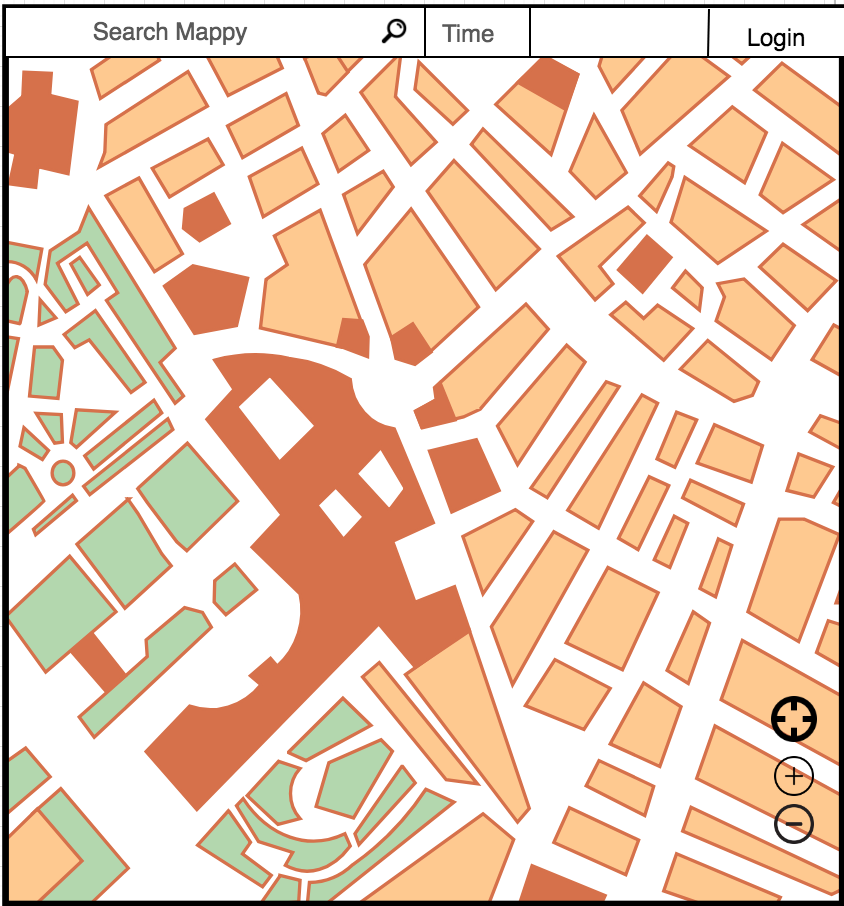
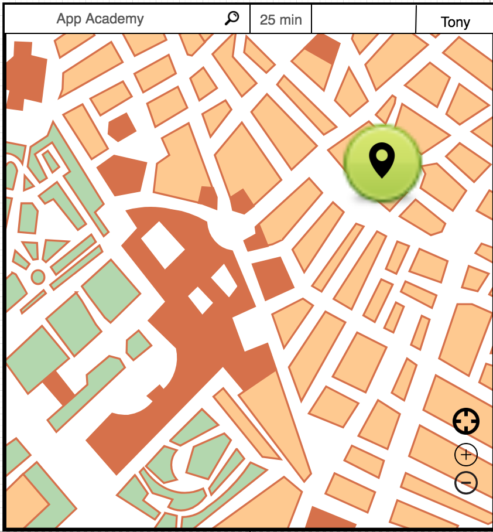

# Background and Overview

“Peripatetic” is an interactive map application, based on the concept of MoneyMap, that allows users to see a defined area where they can go on a given time frame. The area will be impacted by current traffic conditions, construction, weather, and other factors . This allows people to drop pins on any location and have a visual representation of places are within reach according to the time they have available.

# Functionality and MVP

1. Have algorithm return reachable points when a user inputs a start pin and time
2. Get visual cloud to render on Google maps (visually appealing)
3. User signup/login
4. Track favorite places(logged in users)
5. Integrate other modes of transportation
6. Intuitive UI, animations for markers and visual cloud (if time permits)

# Technologies and Technical Challenges

1. MongoDB
2. Express
3. React/ Redux
4. Node.js
5. Google Maps API (Directions/Distance Matrix)

* **Integrating Google Maps:** 
    * Google maps currently provides a distance matrix service where it computes multiple start and end point travel times and distances. This utility allows us to determine how long and far it takes to reach multiple endpoints with a single API call.
* **Constructing the Travel Cloud:**
    * The determined area of travel based on time will have to be based on the given roads and current traffic situation. We will use a (generic latitude/longitude change per minute ) scale to generate the first Google Maps Distance Matrix call. 
    * We will then adjust our API calls accordingly based on the return time of each endpoint vs the time available to the User. We will then adjust each respective endpoint until each of our endpoints is less than or equal to the user request time.
    * Natural barriers such as deserts parks and water will have to be taken into consideration.
* **UX**
    * The Frontend will display a large google maps with a nav-bar at the top
    * There will be a simple input form that can take in an integer for time and a location. Users can drop a pin to enter a location as well. 
    * A Login button will be available which will display a dropdown auth page (or modal)
    * On enter of a search request, it will render a shape cloud displaying the range.

    
    
* **Backend**
    * The backend will take in the start location and deconstruct it to a latitude longitude.
    * Multiple endpoints will radiate out from said location and a distance matrix will be generated to find the time taken to reach each point.
    * If the travel time to a point is less than the given param, expand that radius further out. If the time exceeds the param, retry with a closer point. If the time is equal to the param, save the point and explore the areas around it??
    * A final set up points will be returned to the frontend for google maps to draw out

# Things Accomplished Over the Weekend
* Set up MongoDB, able to connect to server
* Able to create users w/ valid JWToken in Postman
* Basic webpage with embedded Google Maps Tool is already functioning.
* Established Google Maps APIs that can be useful in returning data to dynamically adjust visual cloud parameters
* Addressed possible solutions to avoiding bodies of water in visual cloud
* Addressed most efficient ways to minimize total # of API calls without sacrificing accuracy of visual cloud

# Group Members and Work Breakdown
**DAY 1-2**
* Ensure user authentication is working, read along the mern intro  **GARBO/group**
* Setup a basic frontend design that has a form for location and time **KEVIN**
* Test out the Google Maps Matrix API calls, **TONY**
* Create a rudimentary algorithm for expanding from an argument (single point) **GROUP**
* Setup Github Repo, learn branching, make sure everyone is on the same page **GROUP**

**DAY 3**
* Work on Sign in and Sign out **GARBO**
* Research how to use Google Maps draw API to create a basic shape from results **KEVIN**
* Be able to adjust parameters according to Google Maps API return **TONY**
* Write out logic to stop growth of point if an uncrossable barrier is reached **GROUP**
* Write out bridge logic **GROUP**

**DAY 4-5**
* Visualize points onto google maps, render lines and how to draw shapes on MAP **KEVIN**
* Create multiple test points based on a single origin (4 or 8) **TONY**
* Enable track current location of the device, save location onto database **GARBO**
* Write out first draft of expansion algorithm **GROUP**

**DAY 6**
* Write out expansion algorithm design **TBD**
* Determine checkpoints for growth **TBD**
* Reassess our progress and modify itinerary if needed GROUP **TBD**

**DAY 7**
* About the project
* improve UX

